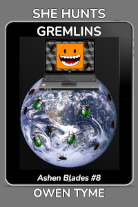

<header>

</header>

# She Seeks Peace

<header>

*She Seeks Peace* is book four of [Ashen Blades](index.html), which centers on the adventures of a half-demon girl (the Hunter) and her friends in an ancient order of demon hunters (The Order of Ash and Smoke, also known as Ashen Blades).

*She Seeks Peace* releases January 10th, 2024.

</header>

>
  
[<button class="buy" style="display: inline-block; width: 100%; max-width: 200px;">Store Links</button>](https://books2read.com/SheSeeksPeace)

>Peace and quiet to think and grieve, that’s all the Hunter wanted, but between old enemies with agendas of their own, angry elemental spirits and her own friends never quite knowing when to leave her be, that elusive moment of quiet contemplation is always just out of reach.
>
> The Hunter’s journey began with the loss of her best friend, the only man that was ever a father figure to her, which reminds her of losing the first real friend she ever had, because the two private detectives had much in common and the similarities compound her grief.
>
> She walks the surface of the Moon, for what better place could there be to seek a quiet moment? Unfortunately, she soon faces an unexpected demon that’s been trapped there for thousands of years. Next, she tries a remote valley watched over by an ally, but the lonely woman pesters the Hunter until she loses her temper and is forced to leave.
>
> She wanders many remote and unusual corners of the world, always in search of that moment of solitude, that she might reflect on the past, but the arch-demon known as Wrath has taken a liking to her, and seeks her hand in marriage. To that end, he posts a bounty for her capture and the path to emotional healing becomes a frustrating battlefield.
>
> She seeks the mythic last of all sanctuaries, but instead finds a half-demon girl much like herself, and a quest to help the lonely child connect with family.
>
> In the midst of the Hunter’s busy and frenetic life, will she find a moment to grieve her two best friends and learn to move on, or will all of creation forever stand in the way?
>

## Looking For More?
The next book in [Ashen Blades](index.html) hasn't been written yet.

Currently, my plans for the next installment of this series have not yet been set and are completely up in the air regarding both which novel is next and even the title of the most likely option.

The next book will probably be [She Hunts Gluttony](../../books.html#she-hunts-gluttony), but that's just a working title and the plot needs more thought before I can write it.

On the other hand, I have the plot for [She Hunts Witches](index.html#she-hunts-witches) mostly worked out in my head, but the trouble with this one is that I'm not sure how to research Japan properly, to write it, because I want that to be the setting.  Ideally, I'd like to go there for a research trip, but I can't afford that.  The next best alternative is interviewing someone that has spent time there, but I don't know anyone that has.

The last option is [She Hunts Gremlins](index.html#she-hunts-gremlins), for which I have very strong plot idea, but the trouble is, I prefer this one to come after the other two, because the novel will have far-reaching consequences to my fictional version of Earth.

