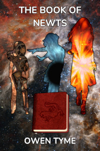
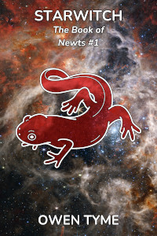
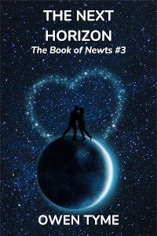

# The Book of Newts

*The Book of Newts* is a remarkable volume.  Paradoxically, while The Book is exceptionally magical, the information contained within is largely not.  It details every wonder of engineering, science and astronomy that's been discovered by its past owners, but this information is only visible to its owner.  To all others, it appears to be a thick volume describing every variation of newt that has ever existed, in meticulous detail, complete with hand-drawn illustrations.

The Book yearns for new knowledge.  To that end, it inspires those that own it to ever greater heights, taking them to the stars and beyond, to reach their greatest potential, but nothing in life comes without a price and its owners rarely foresee the balance coming due.

While The Book is sometimes willing to wait, it's never satisfied and will always drive its owner to the next horizon, to the next discovery, that it might grow a little thicker under the weight of new knowledge.

Throughout history, The Book has been the driving factor behind many things, particularly the colonization of the stars and terraforming of many worlds, all to serve its insatiable hunger for more.

Witches and wizards are drawn to the magic of The Book, but woe betide any that choose to stand in the way of the inevitable march of progress, because The Book has a will of its own and a terrible power to subtly bend its owner's mind, leaving them just as hungry for more knowledge.

At first, The Book seems like a blessing, but it might also be termed a curse.  That's because it always seems to draw unwanted attention, but never to itself, and its owners become magnets for trouble of all sorts.  Accusations of witchcraft often follow them, because science beyond the wildest imaginings of the common man may as well be magic.

## Release Plan {#plan}

Currently, the plan is to release this series in a manner that resembles television, with episodes consisting of up to four chapters and seasons about ten episodes long.  Each novel of the series will be analogous to a season of a show.

Each season will be initially free to read on [Royal Road](https://www.royalroad.com) and [Wattpad](https://www.wattpad.com).  When the next season is ready to be posted, the old season will be published both in Ebook and print editions, while the versions in their original, online locations will become one or two episode teasers.

The first season is done and the first chapter was published on Monday, January 6, 2025.  The rest will follow a chapter at a time, every Monday, Wednesday and Friday.

## [Starwitch](starwitch.html) {#starwitch}
 

  
[<button class="buy" style="display: inline-block; width: 100%; max-width: 200px;">Read on Royal Road</button>](https://www.royalroad.com/fiction/102509/the-book-of-newts)  
[<button class="buy" style="display: inline-block; width: 100%; max-width: 200px;">Read on Wattpad</button>](https://www.wattpad.com/story/386378071-starwitch)

Volume one is [Starwitch](starwitch.html).

The series begins with Amelia Blackwell, a witch with little magic talent, but a keen mind, described by the previous owner of The Book as a prodigy.  She accepts ownership of it with curiosity and a voracious desire to read all she can.

The Book soon gets Amelia and her two older sisters into all sorts of trouble, because the depth of knowledge Amelia demonstrates breeds jealousy, strife and accusations of witchcraft for all the wrong reasons.

Eventually, Amelia constructs a vessel she names [Starwitch](starwitch.html) and the sisters flee the moon they once called home, to seek peace among the stars.  Instead, they find even greater strife and a hostile pirate queen that consumes the souls of witches to extend her own life.

## Legacy of Newts {#legacy-of-newts}

Volume two is *Legacy of Newts* and will involve dealing with the consequences of events from volume one.

Having defeated the pirate queen to rescue her sisters from serving as fuel for that ancient witch's life, Amelia flees, but the undead witch is furious beyond measure and gives chase, determined to run them down.

The sisters seek assistance from everyone they've befriended at every port along the way, but no one has any desire to get between the sisters and their powerful enemy.

There's soon fighting in every corner of the star system, because the Dead Queen's lieutenants smell blood in the water.  Things are poised to go from bad to worse, because sometimes the devil you know is better than the one waiting to fill the power vacuum...

## The Next Horizon {#the-next-horizon}

Volume three is *The Next Horizon*.  It will provide greater detail on The Book and the way it interacts with Amelia.

After settling the matter of the pirates, Amelia and her sisters enjoy a short time of peace, until she begins having dreams and visions that reveal the way to travel from one star to the next, because The Book has finally grown impatient.

Amelia initially resists, because she desires to return to the moon she was born on, that she might reconnect with a man she fell in love with, but The Book won't leave her alone and becomes a source of great frustration.

When the conflict comes to a head, The Book refuses to cooperate and takes back the gifts it's been quietly imparting.  As a result, Amelia discovers it has been bolstering her exceptional ability with mathematics and piloting.  Left to her own devices, the task of navigating space becomes potentially deadly, because she can no longer perform the required calculations in her head.

The journey home becomes perilous and tediously long, compared to just days before, as everything that can get in the way does and she's forced to repeatedly check her math on paper, because her life is on the line.

Just as Amelia and her sisters are struggling with that, they encounter a duo of deadly witches they left behind and hoped never to see again, who have since learned to fly through space and wish for a helping of revenge.

Will Amelia survive long enough to reignite the love she once had, or will she be forced to give up her greatest desire, just to satisfy The Book?

## Witchhome {#witchhome}

In volume four, titled *Witchhome*, Amelia will arrive at a compromise with The Book they can both live with.

Amelia builds a magic, flying city to serve as a home and place of refuge while she explores space, a compromise between her desire to put down roots and the ceaseless need of The Book to go further.

Her massive construction project soon draws attention from all over the system.  Witches and wizards flock to her cause, drawn like moths to a flame by the potential.  Dwarves first supply the resources required, but soon see the allure of the project and lend a helping hand, that they might find the same kind of refuge from prejudice.

Unfortunately, it isn't all good news, and the locals of Amelia's home moon soon rise up, to burn the "cursed city of witches" to the ground.  To avoid all-out war, Amelia's people are forced to launch early, before even basic safety measures can be tested.

Will Amelia manage to have her cake and eat it too, or will all the troubles she seeks to escape finally catch up to her?  Will her people be able to finish their work along the way, or will *Witchhome* come apart before they can reach assistance?

## Beyond the Horizon {#beyond-the-horizon}

In volume five, *Beyond the Horizon*, Amelia will finally begin exploring, as the means to find a place her people can call home.

Amelia flies her magic city full of brave witches, wizards and dwarves to unexplored space, for the sake of establishing a colony where they won't be persecuted for their magical talents.

They carry with them seeds and animals of every kind, with which to make a new home, plus a population composed of every walk of life, including every skill that might be required both along the way and at their destination.

The journey is perilous beyond measure, with strange encounters aplenty, including lethal space weather, aliens with unfathomable motives and a hazardous encounter with a black hole.

Will Amelia's people be able to find a world suitable for terraforming and the construction of a new home, or will their journey end with disaster, for over-reaching their grasp?  Will Amelia be able to resist naming that planet Witchworld?

