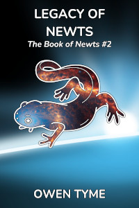

<header>

</header>

# Starwitch

Starwitch is volume one of [The Book of Newts](index.html), which follows the adventures and trials of a witch that owns a magical book detailing many secrets of science, engineering, magic and most particularly, space travel.

>
  
[<button class="buy" style="display: inline-block; width: 100%; max-width: 200px;">Read on Royal Road</button>](https://www.royalroad.com/fiction/102509/the-book-of-newts)  
[<button class="buy" style="display: inline-block; width: 100%; max-width: 200px;">Read on Wattpad</button>](https://www.wattpad.com/story/386378071-starwitch)

> Home, safety, and a place to belong – they seem so easy to find, at least for everyone but Amelia Blackwell and her sisters, who run from accusations of witchcraft at every turn.
>
> It started so simply, with a book. No one might have predicted that a book apparently filled with pictures of newts might lead to so much trouble, but *The Book of Newts* is no ordinary volume on taxonomic detail of amphibians.  The magic book reveals its true nature only to Amelia, at the age of ten, teaching her mathematics, science and engineering – subjects she would not otherwise have been exposed to.
>
> Ironically, she and her sisters are accused of witchcraft for having built a horseless carriage, because to the ignorant villagers, there’s no difference between magic and science. They settle in a new land, only to find the same breed of persecution.
>
> In an unusual ray of hope, they’re told of a distant kingdom that openly accepts witches, but shortly after they settle there, the light at the end of the tunnel turns out to be an awful house fire surrounding their gilded cage: they’re drafted into the local military, because their new nation uses witches as living weapons.
>
> The sisters accept the idea that peace will never be found on the ground.  Looking to the stars, Amelia builds a space vessel powered by magic and steam, to carry them to a brighter future, hopefully without the strife that’s always followed them.
>
> Unfortunately, the people of the stars have their own worries: an ancient, undead pirate queen, who consumes the souls of powerful witches to extend her own life. The Dead Queen takes Amelia’s sisters and leaves the magically-weak engineer to die, all as a sick form of sport.
>
> Will Amelia survive long enough to overcome this greatest of all threats and rescue her sisters, or will they become fuel to feed the waning magic of a woman that should have been dead centuries before?
>

*Starwitch* centers on the life of Amelia Blackwell, the youngest of a trio of sisters and witches, who start out living on a moon and eventually use magic to launch themselves into space, to escape persecution for their witchcraft and various troublesome political events.

Unfortunately, they eventually encounter the Dead Queen, an ancient undead pirate witch that consumes the magic and lives of other witches, to extend her own existence.

The series begins with Amelia aboard her magic light sail ship, *Starwitch*, just a few days after it was badly damaged and her sisters were kidnapped by the Dead Queen, left with only enough resources to follow the far larger ship.

That's an intentional and cruel choice by the Dead Queen, because Amelia's magic is deemed too weak to consume.  She instead left Amelia for dead in the hopes of some sport, something the Dead Queen has done to countless weak witches.

Amelia has just enough resources to attack, but not enough to limp to safety, so unless she gets back either the mythril spell-core of her ship or at least one of her sisters, she's a dead woman.

## Release Schedule and Details

The first chapter was published on Monday, January 6, 2025 and further chapters will come one at a time, every Monday, Wednesday and Friday.

## Looking For More?

The next book in [The Book of Newts](index.html) is [Legacy of Newts](index.html#legacy-of-newts).

