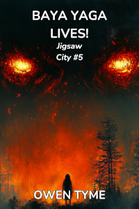
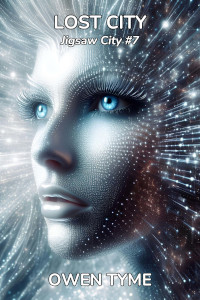

# Jigsaw City {#series}
*Jigsaw City* is a sequel series to [The Wizard's Scion](../wizards-scion/index.html), centered around the life of Levi's daughter, Nicole Jacobs, and her quest to reunite the pieces of a magical city that was broken up millions of years before she was born.

## Release Plan {#plan}

Currently, the plan is to release this series a chapter at a time, on [Royal Road](https://www.royalroad.com).  When the second volume is ready to be posted, the first volume will be published both in Ebook and print editions, while the versions in their original, online locations will become short teasers, perhaps six chapters long.

The first chapter of volume one was published on Saturday, March 8, 2025.  The rest will follow a chapter at a time, every Tuesday, Thursday and Saturday.

## [Jigsaw City](jigsaw-city.html) {#jigsaw-city}

 

  
[<button class="buy" style="display: inline-block; width: 100%; max-width: 200px;">Read on Royal Road</button>](https://www.royalroad.com/fiction/108234/jigsaw-city)

Nicole Jacobs is given a small, hexagonal coin for her twentieth birthday, but during analysis of the strange, magic trinket, she accidentally copies the magic item's base spell into her mind, where it rapidly expands beyond the original design, slowly consuming her mind from the inside!  Nicole reluctantly seeks out the maker of the item, hoping to find a cure before it's too late to save her sanity.

## Fey Fighters {#fey-fighters}

> 

> Forced to give up their original home due to the constant incursions of humans, the fairies long ago retreated from Earth to an out of the way corner of the galaxy to live in peace, but when humans accidentally stumble upon them, they aren't happy and this time, they're not willing to give up their home without fighting until either the extinction of themselves or the human invaders!
> 
> However, nothing’s as it seems, because the humans only arrived as the result of a series of accidents, having been forced to make an unsafe faster-than-light jump through space to the nearest potentially habitable system, which resulted in the destruction of their star ship! With nowhere else to go and faced with the hostile locals, they staunchly defend themselves against constant fey assault.
> 
> Two soldiers on opposite sides, pixie Commander Stargazer Candleflash and human Sergeant Edwin Harris, find their fates forever entwined, first by hatred and the desire for revenge, but then, as they crash together in a rainforest full of danger, they're forced to work together, just to survive.
> 
> Will these two rivals, who have every reason to hate each other, survive or will their bickering get them killed? Is it possible a fragile peace can be forged from their own personal cease-fire or will the doomsday weapons held by both sides be released, ensuring the destruction of everyone?
>

On a distant planet tucked away in a barely explored region of the galaxy, war breaks out between humans that are forced to land there and the fairies that left Earth during World War II, because the human race had become too violent to share a planet with.

*Fey Fighters* introduces true fairies to the setting, who will also be seen in volume three, where they'll play a vital role providing exposition and will also play a part in *The Great Purpose*, due to the linked nature of both demons and fey.

## Collector of Kurg {#collector-of-kurg}

Having accepted the fact that the City of Kurg is permanently bonded to her mind and soul, Nicole seeks to collect all of the missing fragments of the magical city, both on and off her home planet, soon coming into conflict with rogue trolls, ancient monsters, aliens, gun-slinging snails, monkeys with crossbows, giants and even fairies.

*Collector of Kurg* will bring Nicole's adopted mother, Cha'da, into the series, as Nicole encounters her sailing the wilds of the world's ocean.

This one is likely to be a collection of short, but connected tales, rather than a novel, with each planet visited being its own story.

## Baba Yaga Lives! {#baba-yaga-lives}

> 

> Baba Yaga started out wanting to live a little longer, falling to the temptations of necromancy to extend her life, gaining a mere decade or so with each human soul she consumes.  Eventually growing dissatisfied with such meager fare, she turns her attention to consuming the souls of magical creatures for the extra power they contain and her body slowly becomes more magic than flesh, transforming her into a thaumavore.
> 
> However, with the rise of science and magical creatures of the galaxy growing wise to her tricks, there's precious little for her to eat.  She can't afford the hefty price enchanted items sell for on the galactic market and finds their weak magic unsatisfying, anyway, but she does come across a rare and undervalued curio: one of the hexagonal coins that make up the magical City of Kurg, an object so impossibly filled with magic, it has the power to resist her every attempt to consume it!
> 
> She seeks to unlock the hidden power of the coin, hoping to extend her life until the end of time with its nearly limitless magic.  Unfortunately for her, not just anyone can access the magic of Kurg, something only a city administrator can do.  Learning this fact by touching the mind of the coin, she seeks a conversation with Nicole, the only available administrator.
> 
> Nicole's quest to collect the missing pieces of the City of Kurg brings her right to Baba Yaga's doorstep and since their goals are nothing alike and totally at odds, the meeting devolves into a magical duel!  War for ownership of the city follows, eventually leading to a sprawling battle inside the legendary chicken-legged hut of Baba Yaga, a magically-folded, mind-bending space that would give even M. C. Escher a headache!
> 
> Will Nicole overcome the crone's superior, time-tested spells or will Nicole, as an extension of Kurg, become Baba Yaga's living larder?
>

*Baba Yaga Lives!* will bring legendary magical creatures to the city, including Levi's old familiar, Inorath, because Nicole will need information on Baba Yaga and many of them are even older than the ancient witch.

## The Great Purpose {#the-great-purpose}

In this volume of *Jigsaw City*, the true purpose of Kurg is revealed: it was designed as a powerful weapon for fighting a war that's as old as the universe.  The Life Giver is back, in need of Nicole and her city's power, while the Life Giver's nemesis, The Void, attempts to invade the Milky Way, to begin consuming everyone and everything there.

*The Great Purpose* will bring the Hunter from [Ashen Blades](../ashen-blades/index.html) to the city, to combat a nearly limitless supply of demons, because they've finally succeeded in opening a stable portal to the galaxy.  It will also involve the Hunter's arch-nemesis, Vogerath, since the portal was his plan.

## Lost City {#lost-city}

Nicole and the Hunter may have won the battle with demon-kind and The Void, but the cost is extremely high: Nicole sacrifices her life for the success of their crazy suicide mission and the Hunter finally reaches the limits of both her demon and witch powers, with disastrous consequences.

Nicole's body is restored by automatic functions of the City of Kurg, but her mind is shattered by re-birth as its living avatar.  Lost, confused and alone, will Nicole ever return to her home and those she loves or will she forever wander a dying, parallel universe, seeking a home she can't even remember?

Meanwhile, the Hunter is also lost and alone, but in immediate peril.  She emerges from the spatial tear formed by The Void's final kick at thirty-thousand feet above a strange, alien planet, with absolutely no idea where she is.  Even worse, she's lost the power of the elements and been left to her own devices, totally unable to fly.  Will she survive the fall and find some way to get home or will she remain forever lost?

## The Memory Hunt {#the-memory-hunt}

Nicole discovers the fact that her memories were backed up by the city before she was killed, but unlike her body, it was unable to fully restore her mind.

Seeking to regain a greater measure of humanity, Nicole goes back to collecting lost fragments of the City of Kurg, mostly for the sake of restoring her memories.

This takes her beyond the galaxy she knows, to far-flung areas of the multiverse, because when the ancient city broke up, parts of it left the galaxy, while some few traveled to parallel universes.

