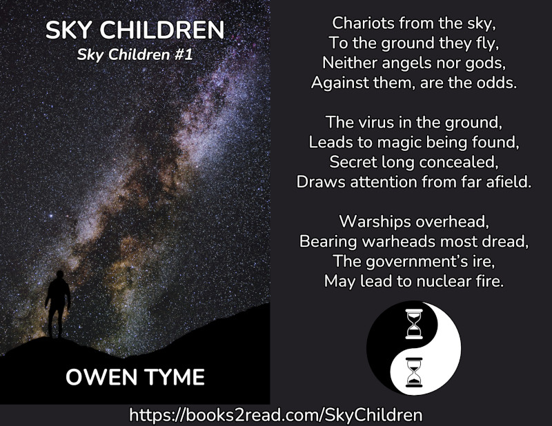

<header>

</header>

# Sky Children

<header>

*Sky Children* is book one of [a series by the same name](index.html), which centers on the life of an electrical engineer named Zechariah Jacobs, who crash lands on a supposedly unexplored planet, only to discover it was colonized and disavowed thousands of years earlier.

Even more interesting, a virus in the soil of the planet gives him magic powers, making him into a wizard.

</header>

> 
  
[<button class="buy" style="display: inline-block; width: 100%; max-width: 200px;">Store Links</button>](https://books2read.com/SkyChildren)

> In a far-flung future where humans have colonized much of the galaxy, Zechariah Jacobs is a colonist sent out by the Northwestern Empire, aboard a star ship destined for the frontier, but there’s a rebellion on board and he’s forced to scuttle the ship, on the captain’s orders.
> 
> Launching an escape pod, Zechariah lands alone, on an “unexplored” planet. Knowing help is months, if not years away, he explores. He finds plant and animal life remarkably similar to what his colony ship would have seeded and shortly after encounters remarkably human-looking natives, with pointed ears!
> 
> As he’s taught the local language, he learns the forest-dwelling locals are elves and just beyond the hill is a village of dwarves. He’s introduced to the dwarves and their leader, Winzon, who calls himself a “history miner.” Winzon takes him to one of his best finds: an ancient wrecked space fighter, that’s thousands of years old!
> 
> Zechariah accesses the black box, discovering his people used a quarantine as an excuse to nuke one of their own colonies from orbit, seeing awful images of the fighter gunning down the survivors, leaving him wondering why!
> 
> Almost as if in answer, he catches an illness called “Mind Fire,” which grants him strange, magic powers that defy science!
> 
> Using magic and technology, he helps Winzon’s search for more tech, eventually discovering a star ship!  Feeling disquieted by what they know, they gather a crew for the ship, teach them using software left in the ship’s computer, then go on a mission to visit one of the Empire’s media hubs, to share all they know with the public.
> 
> Will they get the truth out or will the crew of the ship become the most recent in a long line of victims snuffed out by the empire’s secret cover-up operation?
>

<iframe frameborder="0" src="https://itch.io/embed/3432102?bg_color=222222&amp;fg_color=eeeeee&amp;link_color=205080&amp;border_color=363636" width="552" height="167"><a href="https://owentyme.itch.io/sky-children">Sky Children by Owen Tyme</a></iframe>

## Looking For More?

The next book in [Sky Children](index.html) is [Wrath of the Sky](wrath-of-the-sky.html).

