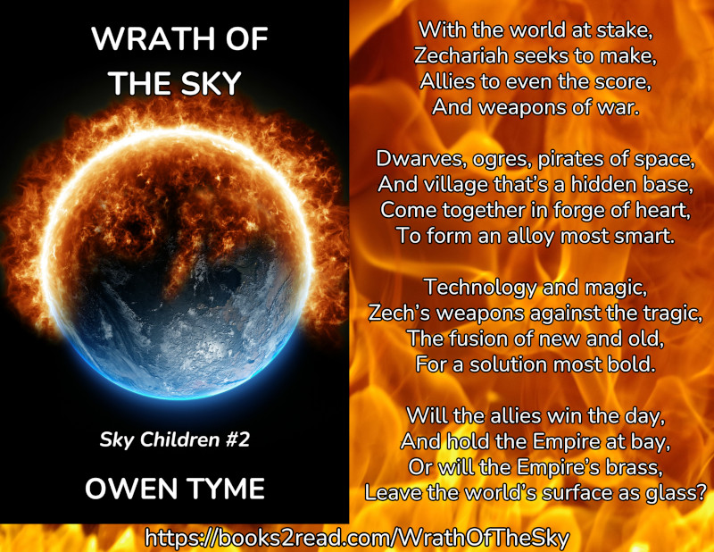
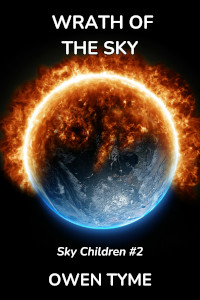

<header>

</header>

# Sky Children

<header>

*Wrath of the Sky* is book two of [Sky Children](index.html), which centers on the life of an electrical engineer named Zechariah Jacobs, who crash lands on a supposedly unexplored planet, only to discover it was colonized and disavowed thousands of years earlier.

Even more interesting, a virus in the soil of the planet gives him magic powers, making him into a wizard.

</header>

> 
  
[<button class="buy" style="display: inline-block; width: 100%; max-width: 200px;">Store Links</button>](https://books2read.com/WrathOfTheSky)

> After the hornet’s nest Zechariah Jacobs kicked, by revealing the dark secrets of the Northwestern Galactic Empire, all he wants is to get home, but that may not be so easy. The Imperial Intelligence Core is out for blood and more committed then ever to killing Zech, that they might more reasonably claim his evidence of the colony they nuked is false.
>
> Zech and the crew of his star ship battle their way home by the skin of their teeth, only for Zech to get some awful news: the Empire has sent an entire fleet, which is packed to the gills with thermonuclear ordnance and their primary mission is to glass the planet.
>
> Zech and friends seek all the allies they can get, reaching out to ogres and a remote village that turns out to be far more than meets the eye, while an ex-pirate officer of his ship requests space pirate and even alien aid. Meanwhile, Zech and the wizard he’s apprenticed to work to mix magic and technology, to build weapons they hope will turn the tide of war, including teleporters, energy shields and multifunction guns that shoot spells, based on software.
>
> Friendly ships arrive in orbit to help, but in too few numbers, compared to the colossal fleet the Empire has fielded. Will Zech and his friends survive the terrible fury of the Empire or will they lose everything they love, including the very ground they stand on?
>

<iframe frameborder="0" src="https://itch.io/embed/3442981?bg_color=222222&amp;fg_color=eeeeee&amp;link_color=205080&amp;border_color=363636" width="552" height="167"><a href="https://owentyme.itch.io/wrath-of-the-sky">Sky Children #2: Wrath of the Sky by Owen Tyme</a></iframe>

## Looking For More?

The next book in [Sky Children](index.html) is [Wild Sky](index.html#wild-sky).

