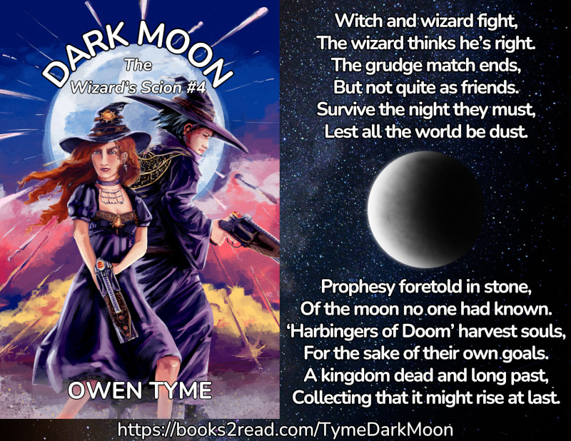

<header>

</header>

# Dark Moon

<header>

*Dark Moon* is book four of [The Wizard's Scion](index.html), which centers on the life of a young wizard (Levi Jacobs), who's the son of the greatest wizard his world has ever seen.  It follows the adventures of this young man, his family and his friends, as he slowly learns to master his wizardly powers over the course of the series.

</header>

> 
  
[<button class="buy" style="display: inline-block; width: 100%; max-width: 200px;">Store Links</button>](https://books2read.com/TymeDarkMoon)

> The Steel Wizard, Captain Levi Jacobs, second-guesses himself over a shuttle and her crew that dangerously vanish into deep space.  As search and rescue operations fail to turn up any any trace of them and he’s pressured to declare them ‘missing, presumed dead’, his worries grow.
>
> After following a nearly-hopeless trail of bread crumbs, he discovers the shuttle crew managed to return to their home planet, but were killed shortly after arriving by a skilled necromancer-witch named Cha’da and her crew of goblin pirates.  With his hopes of rescuing his people dashed, Levi turns his attention to punishing the responsible party.
>
> In the background, strange mysteries unfold as the invisible moon no one knew the world had reveals itself as a crescent that grows toward a full circle in the sky!
>
> As the sun sets and the full moon rises, Levi faces Cha’da in a magical duel, but nothing is as it appears.  Cha’da isn’t evil, having killed the shuttle crew in self-defense, while subtly trying to redirect her blood-thirsty pirate crew to a less violent way of life.
>
> As night begins and strange ‘Harbingers of Doom’ from the moon crash into the ocean, bent on harvesting life energy, the two enemies are forced to fight back-to-back, just to survive!
>
> Will Levi and Cha’da live long enough to save the world or will the alien harvesters steal the souls of everyone they love as part of their dark harvest?
>

## Looking For More?

The next book in [The Wizard's Scion](index.html) is [The Inverted Glass](the-inverted-glass.html).

