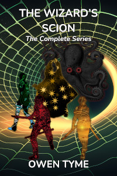

# The Wizard's Scion

This series follows the life of a great and powerful wizard's son, Levi Jacobs, as he grows from a teenage boy with almost no control over his magic to a wizard of great power and reputation, that masters the secrets of time travel.

The setting of this five volume series began as a relatively hard science background, with only one big rubber science addition: some faster than light technology that's used for travel and communication.  Magic was largely unknown to everyone except the space pirate, until an electrical engineer crash-landed on an "unexplored" planet that bore a strange virus that gave him the powers of a wizard.

That electrical engineer who became a wizard was Levi's father, Zechariah.  Zechariah is both directly and indirectly responsible for the invention of many magi-tech devices, which mix magic and technology together, using electricity to produce powerful spells beyond what any wizard could do alone, leading to a setting in which wizards fly through space in star ships that have the usual rubber science sci-fi bells and whistles, including force fields and teleporters, as well as guns that shoot magic spells.

## The Complete Series {#complete-series}

<header>

</header>

> 
  
[<button class="buy" style="display: inline-block; width: 100%; max-width: 200px;">Store Links</button>](https://books2read.com/TheWizardsScion)

> Levi Jacobs always dreamed of being more like his father, the greatest wizard in the world, but had no real understanding of what it would be like if he got his wish.
>
> Follow Levi's journey from bumbling teen to a great hero, while the young wizard learns to master magical powers that are initially completely beyond him and barely under his control.
>
> Meanwhile, he's forced to deal with a psychotic telepathic swordswoman, an army of trolls, retrieving stolen star ships, a war with forgotten monsters that no one believes in anymore, alien space pirates, time travelers, a telepath that collects minds like shiny stones, a necromancer that leads a ship of murderous goblins, rock monsters from the invisible moon, a master of manipulating probability and a perilous trip through the Greek Underworld, to have a conversation with The Fates.
>
> But it gets worse: Levi's family always seems to be caught in the middle of every disaster that comes along, leaving him with no choice but to deal with it.

This omnibus edition includes all five volumes in the series (see below) and will be published as an Ebook on April 11, 2025.

<iframe frameborder="0" src="https://itch.io/embed/3430500?linkback=true&amp;bg_color=222222&amp;fg_color=eeeeee&amp;link_color=205080&amp;border_color=363636" width="552" height="167"><a href="https://owentyme.itch.io/the-wizards-scion">The Wizard's Scion by Owen Tyme</a></iframe>

## [Troll Song](troll-song.html) {#troll-song}

The series starts with [Troll Song](troll-song.html), which tells the tale of an unusual young troll girl that catches Levi's eye and who's very important to his story, named Lyra.

She learns early on, by comparing her life to that of a dwarf, her family are neither healthy nor particularly good and seeks to escape them.  [Troll Song](troll-song.html) covers her journey to freedom.

[Troll Song](troll-song.html) begins fully immersed in the fantasy elements of the series, then slows begins introducing sci-fi elements, before fully immersing the reader in a mixture of the two, after a large forward skip in time, because the main characters got frozen in ice for two-thousand years.

That's when Lyra meets Levi, who frees her from the ice and becomes her first modern friend.

Here's an audio sample of this novel:

<audio controls style="width: 100%;">
  <source src="../../mp3/troll-song-teaser.mp3" type="audio/mpeg"/>
Your browser doesn't seem to support playing MP3 files.
</audio>

## [Forgotten Legends](forgotten-legends.html) {#forgotten-legends}

The second volume, [Forgotten Legends](forgotten-legends.html), covers the events of a war between humanity and the ancient, forgotten gods and legendary creatures they once believed in, but have forgotten, due to the rise of science.

Humanity inadvertently angers the legends by disturbing their last refuge in reality and the Four Horsemen of the Apocalypse lead the charge to strike back, with Levi and his family caught up in the middle.

Unknown to Levi and his family, the fates have been manipulating events to to bring about the death of his mother, Rachel, who has the power to see the future and guide her own fate, which they see as an affront.

Levi makes a new ally in this novel, in the form of the monster from under his childhood bed, a creature of darkness named Inorath, which used to give him nightmares and taunt him in the dark.  They bond as wizard and familiar, that they might work together to end the war.

## [The Third Wish](the-third-wish.html) {#the-third-wish}

In the third volume, [The Third Wish](the-third-wish.html), old enemies of the Jacobs family come together to seek revenge, using a time machine, with the intent to re-write history to suit themselves.

Worst of all, the time travelers bring Lyra's evil sisters back to life by cloning them, reigniting the conflict from [Troll Song](troll-song.html).

Meanwhile, Levi deals with an angry, alien pirate, Captain Dandy, a sentient dandelion with a sense of pride so strong that every tiny slight becomes a mountain of offense.  He's angry over the way Levi's parents have treated him for two decades and seeks revenge by destroying their world and their son.

As the conflict begins in earnest, Levi is shocked to meet his future self, who gives him the chance to follow the time travelers into the past.  This is the first hint that Levi will eventually unravel the mysteries of temporal magic.

## [Dark Moon](dark-moon.html) {#dark-moon}

Volume four is [Dark Moon](dark-moon.html).

Unknown to everyone, Levi's home world has had an moon all along, but it was hidden away in another dimension.  When it begins to manifest in the mundane universe, it becomes a portent of great trial and burdensome times.

Levi, however, is distracted by the death of some the crew of his star ship and eventually tracks down the necromancer responsible for their deaths and faces the witch in a magical duel.

He soon discovers the reasons for her actions aren't cut and dried evil and even admits he might have done the same thing.

As their duel comes to an end, the full moon rises and monsters fall from it, splashing down in the ocean around them.  They're soon caught in a battle for their lives, fighting back to back, relying on each other to survive, despite how much they hate each other.

## [The Inverted Glass](the-inverted-glass.html) {#the-inverted-glass}

The fifth and final volume is [The Inverted Glass](the-inverted-glass.html).

In this story, Levi's wife and daughter die in childbirth and he's left reeling from one awful event to the next, unable to cope, eventually losing just about everything he cares for.

In the depths of his deepest sorrow, he's reminded he once saw himself travel through time.  He begins studying that most dangerous and powerful of all magics, determined to regain everything he's lost, but when he does gain that power, he's forced to confront the very fates themselves, that he might gain permission to make the changes he desires.

However, just getting an opportunity to speak with them is next to impossible, because their cave is at the end of a perilous journey through the Greek Underworld and the realm of Hades, who's famed for his dislike of living intruders.

