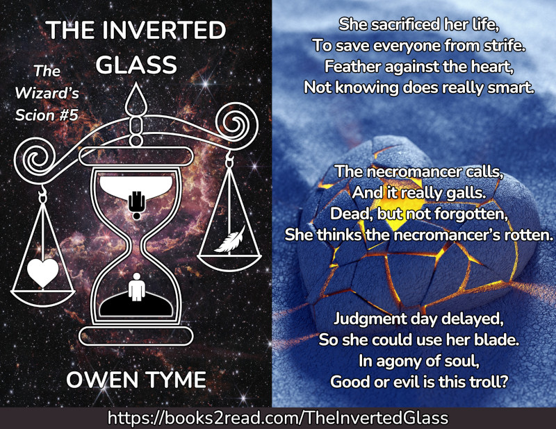

<header>

</header>

# The Inverted Glass

<header>

*The Inverted Glass* is the fifth and final volume of [The Wizard's Scion](index.html), which centers on the life of a young wizard (Levi Jacobs), who's the son of the greatest wizard his world has ever seen.  It follows the adventures of this young man, his family and his friends, as he slowly learns to master his wizardly powers over the course of the series.

</header>

> 
  
[<button class="buy" style="display: inline-block; width: 100%; max-width: 200px;">Store Links</button>](https://books2read.com/TheInvertedGlass)

> The Steel Wizard, Captain Levi Jacobs, is woken in the night by his pregnant wife, with happy news their child is coming, but joy becomes tragedy as she dies in childbirth. Reeling from this loss, he vows to raise their daughter to be a strong hero, just like her mother, but even that fleeting comfort is stolen from the bittersweet moment as the poor infant struggles to breathe and dies in his arms!
>
>Reeling at the loss, he staggers from one defeat to the next, slowly losing everything else he cares about.
>
>Finally, after a particularly traumatic defeat at the hands of a new enemy, followed by a prolonged kidnapping involving the forced administration of narcotics to make him complaint, he lies in the infirmary of his ship, grief-stricken and struggling with addiction withdrawal. Just when he’s at an all-time low, he’s offered a ray of unusual hope, reminded that he once witnessed his future self travel through time.
>
>Armed with this memory, he focuses to unlock the secrets of temporal magic, intent on undoing months of terrible events, only to find it’s not so easy, because he has to fight to gain the approval of the Moirai, better known as the Three Fates and speaking with them is no easy task.
>
>Can Levi change history or will all that he loves remain forever lost in the past?
>

## Looking For More?

[Jigsaw City](../jigsaw-city/index.html) is a follow-up series that centers on the life of Levi's daughter, Nicole Jacobs, as she collects pieces of an ancient, magical city.

The prequel series, [Sky Children](../sky-children/index.html), centers on the life of Levi's father, Zechariah Jacobs, and his journey from a simple electrical engineer to becoming the greatest wizard in history, as well as his descent into an addiction to magic.

