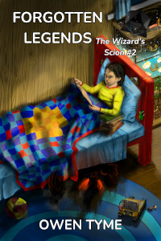

<header>

Here's an audio sample of this novel:

<audio controls style="width: 100%;">
  <source src="../../mp3/troll-song-teaser.mp3" type="audio/mpeg"/>
Your browser doesn't seem to support playing MP3 files.
</audio>

</header>

# Troll Song

<header>

*Troll Song* is book one of [The Wizard's Scion](index.html), which centers on the life of a young wizard (Levi Jacobs), who's the son of the greatest wizard his world has ever seen.  It follows the adventures of this young man, his family and his friends, as he slowly learns to master his wizardly powers over the course of the series.

</header>

> 
  
[<button class="buy" style="display: inline-block; width: 100%; max-width: 200px;">Store Links</button>](https://books2read.com/TrollSong)

> 
> Lyra never intended to cause the extinction of the troll race, but when she uses the power of troll song to read the mind of a dwarf, she's forced to compare her life of abuse to that of a loving family.
> 
> Acting for the good of the world, she betrays her family and her race by revealing the secrets of the trolls. For the sake of the dwarves, Lyra kills her oldest sister, creating an opportunity for the dwarves to defeat a disorganized army composed of their brothers.
> 
> The middle sister, Lyra's childhood nemesis and personal tormentor, Nicole, is furious beyond all rationality over her youngest sister's actions, determined to make Lyra pay, no matter the cost! Death would be too good for Lyra, so Nicole seeks to telepathically destroy her mind, instead!
> 
> Luring her sister into a trap, Lyra drops an entire mountain of ice on their heads, intent on ending Nicole at the expense of her own life!
> 
> They wake from their frozen sleep thousands of years later in a world of wonders both scientific and magical. As Nicole escapes, the contest begins anew and she gains control of a powerful star ship, intending to use it as a platform for her vengeance!
> 
> Meanwhile, Lyra gains modern allies, including the influential family and friends of a young wizard, Levi Jacobs.
> 
> Will Lyra defeat her murderous sister or will Nicole destroy Lyra's mind to fulfill her vow of vengeance? Will Lyra end the troll threat or will Nicole become a scourge on the entire world, raiding and pillaging as she sees fit?
>

## Looking For More?

The next book in [The Wizard's Scion](index.html) is [Forgotten Legends](forgotten-legends.html).

